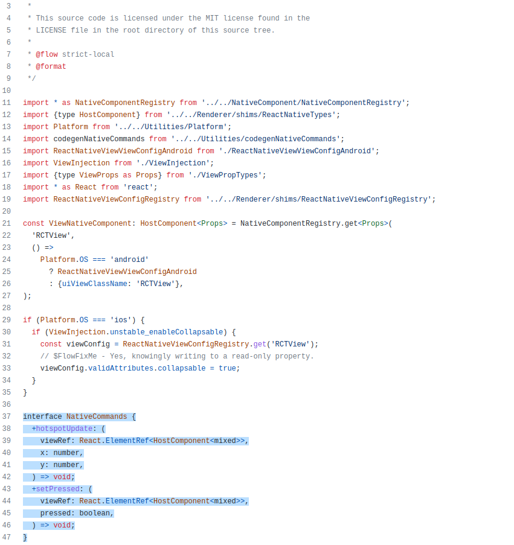

# Reutilização de Front End

## 1. Introdução

Além da reutilização aplicável a nível de projeto (utilizando boas práticas e padrões de projeto já bem estabelecidos, testados e comuns a diversos projetos) pode-se ter em foco a reutilização a nível de código e de componentes e bibliotecas. Evidenciamos uma visão para a reutilização do Front-end. 

## 2. Metodologia

Através de uma análise das tecnologias utilizadas e de suas documentações e código, e dos conceitos aprendidos nas aulas e da disciplina de Arquitetura e Desenho de Software, propôs-se uma descrição das características de reutilização do Front-end, como um framework. 

## 3. Análise

### 3.1. Definição

A tecnologia utilizada para compor o front-end (Aplicativo) do projeto Ser Fit, foi o [React-Native](https://reactnative.dev/). Segundo o próprio projeto ([repositório](https://github.com/facebook/react-native)), *open-source*, mantido pela empresa Facebook, o React native é "Um framework para construir aplicações nativas utilizando React". Percebe-se que, assim como outros frameworks, como o [Flutter](https://flutter.dev/), o React-Native pretende ser um framework *cross-platform*, isto é, funcionar em diferentes ambientes. No caso do React-Native, serve tanto para desenvolvimento para aparelhos que utilizam sistema IOS quanto para o sistema Android e plataformas web, bastando algumas alterações de compatibilidade e na hora de se evidenciar o build. Com isso já se é possível ver o favorecimento da reutilização do software desenvolvido, servindo para diversas plataformas, com poucas modificações do código. Mas primeiramente podemos verificar como o React Native se encaixa na definição de framework.

Como exposto na aula de REUTILIZAÇÃO & FRAMEWORK (vide referências) uma das definições de framework, descritas por Fayad et al, 1999, é de que "um framework é um conjunto de classes que constitui um projeto para a solução de uma família de problemas". Isso pode ser percebido no código do projeto React-native, que mesmo com a estrutura permissiva da linguagem javascript, utiliza a sintaxe do typescript para o controle de Interfaces e estruturas abstratas (Figura 1).

<capition>Figura 1: Amostra do código typescrirpt utilizando uma interface para a construção do componente View, um container para outros componentes dentro da estrutura do App.</caption>

<caption>Fonte: [https://github.com/facebook/react-native/blob/0.65-stable/Libraries/Components/View/ViewNativeComponent.js](https://github.com/facebook/react-native/blob/0.65-stable/Libraries/Components/View/ViewNativeComponent.js)</caption>

### 3.2. Análise de tipo 

A utilização mais comum do react-native é como um framework de caixa-preta, ou seja, sua reutilização se dá por composição de componentes já construídos, utilizando-se dos atibutos das instâncias para customização e configuração. Na Figura 2, no código a seguir, do projeto Ser Fit, segue um exemplo disso. O código pode ser acessado no repositórios, [clicando aqui](https://github.com/UnBArqDsw2022-1/2022.1_G5_SerFit_App/blob/main/app/views/MainMenu/index.jsx)

``` javascript
import React, { Fragment, useEffect, useState } from "react";
import menuImage from "./../../assets/menu-image.png";
import { View, Image, StyleSheet, ScrollView } from "react-native";
import PrimaryButton from "../../components/buttons/PrimaryButton";
import AsyncStorage from "@react-native-async-storage/async-storage";

const MainMenu = (props) => {
  let [screenTargets, setScreenTargets] = useState({
    meuPerfil: { name: "Meu Perfil", pathName: "Profile" },
    atividades: { name: "Atividades da Academia", pathName: "" },
    exercicios: { name: "Exercícios", pathName: "SelectCategory" },
    pesquisar: { name: "Pesquisar Profissional", pathName: "" },
    loja: { name: "Lojas", pathName: "SelectStore" },
  });

  useEffect(() => {
    try {
      AsyncStorage.getItem("selectedAccount").then((accountType) => {
        console.log("Async being executed");
        if (accountType === "personal") {
          console.log(accountType);
          setScreenTargets({
            ...screenTargets,
            pesquisar: { name: "Meus Clientes", pathName: "" },
          });
        }
      });
    } catch (error) {
      console.log("Error getting account type", error);
    }
  }, []);
  const styles = StyleSheet.create({
    container: {
      flex: 1,
      alignItems: "center",
      justifyContent: "flex-start",
      alignItems: "stretch",
      flexDirection: "column",
      width: "100%",
    },
    topImage: {
      alignSelf: "center",
      maxWidth: "100%",
      marginTop: 50
    },
    buttonGroup: {
      display: "flex",
      padding: 0,
      border: "none",
      flexDirection: "column",
      marginTop: 20,
      marginLeft: 15,
      marginRight: 15,
      height: 100
    },
    button: {
      marginBottom: 15,
      height: 25,
      flexBasis: 50,
    },
  });

  return (
    <View style={styles.container}>
      <Image style={styles.topImage} source={menuImage} />
      <View style={styles.buttonGroup}>
        {Object.keys(screenTargets).map((target, ind) => {
          return (
            <Fragment key={ind}>
              <PrimaryButton
                text={screenTargets[target].name}
                clickEvent={() => {
                  props.navigation.navigate(screenTargets[target].pathName);
                }}
                style={styles.button}
              />
            </Fragment>
          );
        })}
      </View>
    </View>
  );
};

export default MainMenu;
```
Pelo código, é possível verificar a importação de componentes do framework. Como View, Image e StyleSheet. Esse componentes são instaciados e configurados no retorno da função, para serem renderizados.

Uma fonte de HotSpots do React-Native são seus métodos hooks para objetos funcionais que permitem a modificação e inserção de métodos dentro do ciclo de vida desses componentes, sem ter que criar uma classe para isso, permitindo a customização desses métodos de templates que são implementados em todos os componetes React. Isso pode ser visualizado no código disponibilizado acima, com a utilização do hook **useState** que insere um método (set) à ser executado e uma variável que para ser modificada, sem que seja necessário renderizar toda a página.

## 4. Conclusão

Para o aplicativo Ser Fit, que funciona como o Front-end do projeto, o React-Native, por ser um Framework extremamente robusto e que permite a criação dos nossos próprios componentes através da configuração de componentes genéricos, facilita grandemente a reutilização de software do projeto, contribuindo para sua manutenibilidade e escalabilidade, por conseguinte. Com alguns controles (como o objeto Platform.os que permite verificar em qual ambiente a aplicação está sendo rodada) e utilizando o mesmo projeto, Ele permite o desenvolvimento de um único código para as plataformas mais utilizadas no mercado (Web, Android e IOS) ou seja, o conceito eficiente de reutilização.

## 4. Referências

> SERRANO, Milene. Arquitetura e Desenho de Software - Aula REUTILIZAÇÃO & FRAMEWORK 1º/2022. Material apresentado para a disciplina de Arquitetura e Desenho de Software no curso de Engenharia de Software da UnB, FGA.

> https://reactnative.dev

> https://github.com/facebook/react-native

> VERGILIO, Silva. Padrões Arquiteturais. Disponível em: https://www.google.com/url?sa=t&rct=j&q=&esrc=s&source=web&cd=&ved=2ahUKEwjEkciDvIX6AhXXrpUCHZcmB7kQFnoECAgQAQ&url=https%3A%2F%2Fwww.inf.ufpr.br%2Fandrey%2Fci163%2FPadroesFrameworksAl.pdf&usg=AOvVaw2nCtwyri-MjTiQZhY53qcS

## Histórico de Versionamento

| Versão | Alteração                        | Autor(es)    | Revisor(es) |
| ------ | -------------------------------- | ------------ | ----------- |
| 1.0    | Criação do documento             | Adrian Soares| ---         |


<style> 
body {
    text-alignment: justify;
}
p, caption {
    text-alignment: justify;
}
</style>