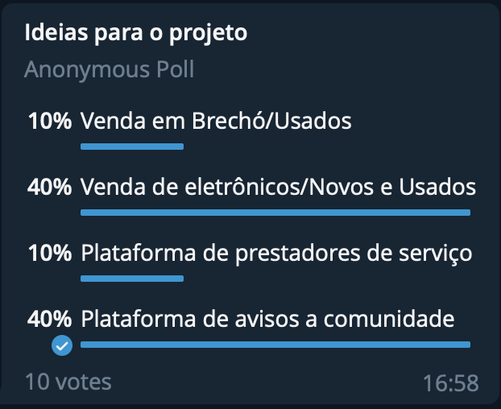

# Brainstorm

## 1. Participantes

- Adrian Soares Lopes
- Daniel Vinicius Ribeiro Alves
- Felipe Correia Andrade
- Fernando Ribeiro Aguilar
- Gustave Augusto Persijn
- Lucas Gomes Lopes
- Luis Gustavo Avelino de Lima Jacinto
- Ricardo de Castro Loureiro
- Victor Hugo Siqueira Costa
- Wesley Pedrosa dos Santos

## 2. Introdução

Brainstorming, também chamada de tempestade de ideias, é uma técnica utilizada para propor soluções a um problema específico. Consiste em uma reunião na qual os participantes devem ter liberdade de expor suas sugestões e debater sobre as contribuições dos colegas.

Normalmente, equipes realizam um brainstorming no início dos projetos como forma de encontrar soluções inovadoras para os problemas atuais, mas também pode se incorporar essa técnica sempre que surgir a necessidade de novas ideias.

## 3. Brainstorms

Utilizou-se da técnica de Brainstorm para propor soluções para diversos tópicos relevantes ao desenvolvimento do projeto. Utilizando das tecnologias citadas nos tópicos anteriores, serão apresentadas a seguir:

### 3.1 Tema do Projeto

Foi utilizado a técnica de Brainstorm para a resolução dessa tarefa. A partir de uma reunião com todos os membros do grupo, foram escolhidos possíveis temas para o projeto e, após isso, com o apoio da ferramenta Telegram que possibilita a geração de votações rápidas, foi tomada a decisão do tema do projeto.

### 3.2 Escopo do Projeto

Para a realização do Brainstorm foi utilizada a ferramenta <a href="https://www.mindmeister.com/">MindMeister</a> que permite a construção de um mapa mental colaborativamente. Utilizou-se a técnica de Mapa Mental para documentar o Brainstorm pois são "diagramas de fluxo de pensamento" cujo grande objetivo é deixar o pensamento visualmente organizado, para que seja fácil recuperar a informação ali contida.

## 4. Requisitos Elicitados

**Legenda**

- BS: Brainstorm
- RF: Requisito Funcional
- RNF: Requisito não Funcional

| ID   | Descricão                                                                                 | Tipo de Requisito |
| ---- | ----------------------------------------------------------------------------------------- | ----------------- |
| BS01 | O usuário deve capaz de se cadastrar e fazer login na plataforma | RF |
| BS02 | O usuário deve capaz de se editar o seu cadastro | RF |
| BS03 | O Prestador de Serviço deve capaz de classificar o tipo de serviço                        | RF                |
| BS04 | Um usuário deve ser capaz de recomendar um prestador de serviço para outro usuário        | RF                |
| BS05 | A plaforma deve agendar um grade horária com os serviços agendados                        | RF                |
| BS06 | O usuário deve poder fazer uma vídeo chamada para o atendimento do serviço adquirido      | RF                |
| BS07 | O usuário deve ser capaz de buscar prestadores de serviços                                               | RF                |
| BS08 | O usuário deve ser capaz de filtrar serviços por nome e avaliação                                              | RF                |
| BS09 | O usuário deve conseguir avaliar prestadores de serviço e vice versa | RF |
| BS10 | A plataforma deve ter uma seção de destaque                                               | RF                |
| BS11 | O Prestador de serviço deve ser capaz de cadastrar, editar e excluir um serviço | RF |
| BS12 | O Prestador de serviço visualizar o perfil de seus clientes | RF |
| BS13 | A plataforma deve fornecer link de lojas parceiras que vendem produtos fitness | RF |
| BS14 | A plataforma deve ter chat de mensagens para permitir interação entre os usuários         | RF                |
| BS15 | O usuário deve capaz de fazer logout na plataforma | RF |
| BS16 | O usuário poderá ver e editar as informações da sua conta conta. | RF |
| BS17 | O Prestador de serviço poderá ver e escolher os serviços que deseja prestar | RF |

## 5. Referências

- Brainstorming: O Que É, Como Fazer. Disponível em: < <https://neilpatel.com/br/blog/o-que-e-brainstorming/> >
- Mapa Mental e Mapa Conceitual. Disponível em: < <https://prof.valiante.info/dicas-de-estudo/mapa-mental-e-mapa-conceitual> > Acesso em: 21 de Junho de 2022

## Histórico de Versionamento

| Versão | Alteração                                      | Autor(es)    | Revisor(es) |
| ------ | ---------------------------------------------- | ------------ | ----------- |
| 1.0    | Criação do documento                           | Luis Gustavo | ----        |
| 1.1    | Adição da introdução, brainstorms e requisitos | Luis Gustavo | ----        |
