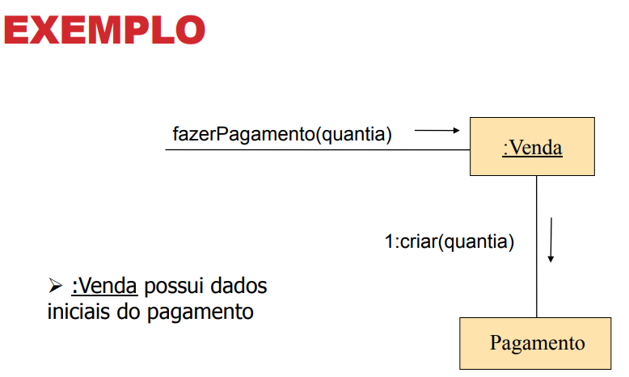

# GRASP Criador

## Introdução

Assim como outros GRASPs, o GRASP Criador acaba sendo um princípio, além de um padrão de projeto, pois é uma garantia da responsabilização correta da criação de instâncias para a classe que conseguirá lidar com isso de forma mais eficiente e manutenível, seguindo os princípios básicos da orientação à objetos, sendo algo que deve guiar todo o desenvolvimento de um Software reutilizável.

## Explicação

A criação deve ser delegada à classe que tenha a melhor expertise para instanciar a classe. Apesar de parecer óbvia, essa noção é de suma importância, pois nem sempre a melhor classe será a própria classe.

Os critérios para a seleção de uma Classe como responsável pela criação são:

- A Classe é a mais geral dentro de uma relação de todo x parte (Ex.: Agregação/Composição);
- A Classe precisa registrar a outra, como uma Classe que se comunica com o Banco de Dados ou que cria uma Cache;
- A Classe conhece os dados iniciais da outra (é íntima).

Por exemplo uma classe de Venda que possua os dados iniciais de um pagamento deve ser a melhor classe para criar a instância de Pagamento.

<caption>Exemplo de criação</caption>

<caption>Fonte: https://edisciplinas.usp.br/pluginfile.php/2186358/mod_resource/content/1/Aula09_GRASP.pdf</caption>

## Projeto

No projeto Ser Fit, esse princípio deverá permear todas as nossas implementações. Sempre em que pensarmos nas atribuições de criação de instâncias, estamos pensando em GRASPS criadores. Um exemplo de responsabilidade de criação usada em nosso projeto é o [Factory](#) que está especificado dentre os padrões GOFS utilizados.

