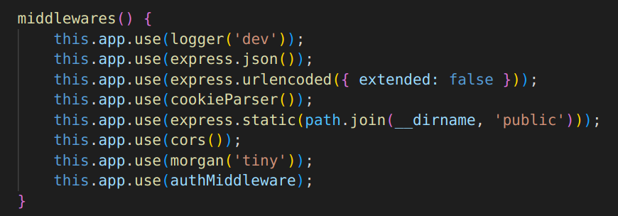

# Proxy

## 1. Introdução

 O proxy é um padrão de projeto estrutural que age como um objeto, manipulando o acesso ao objeto original, segundo as diretrizes da orientação a objetos. No geral, podemos dizer que a classe Proxy tem um campo de referência que vai apontar para um objeto do serviço, e, após a finalização da sua ação, ele retorna o perdido para o objeto do serviço. No tópico a seguir, veremos um exemplo real de proxy, como também um exemplo do padrão no nosso projeto.

## 2. Usabilidade

 Antes de partirmos para o exemplo no projeto, um exemplo fácil para entender o padrão proxy é o conceito de um cartão de crédito, que atua como um proxy entre uma conta bancária e o dinheiro em si. O cliente vai se beneficiar por não carregar muito dinheiro, enquanto o dono de uma loja tem mais controle do seus lucros. 

Assim, partindo-se para um escopo transacional, o padrão proxy na imagem abaixo atua com o JWT Auth Proxy entre o frontend e o backend, participando na autenticação das requisições. Dessa forma, o JWT irá prover modificações na REST API para modificar objetos e guardar dados do user através dos tokens de segurança.

## 3. Aplicação

Agora falando no escopo do projeto SerFit, o proxy pode estar conectado ao padrão emergente middleware, que funciona como uma camada de transição dessas manipulações, assim, podemos dizer que em uma camada middleware pode haver vários proxys atuando. No projeto em questão, o proxy se dá pelo JWT Auth Proxy:

Proxy atuando no middleware:

Autenticação com o JWT Proxy Auth:

Verificação dentro do classe Proxy:

## 4. Bibliografia

> Refactoring Proxy. Disponível em <https://refactoring.guru/pt-br/design-patterns/proxy>
> About JWT Auth Proxy. Disponível em <https://jwt-auth-proxy.readthedocs.io/en/latest/>
> Proxy Design Pattern. Disponível em https://refactoring.guru/pt-br/design-patterns/proxy

## Histórico de Versionamento

| Versão | Alteração            | Autor(es)       | Revisor |
| ------ | -------------------- | --------------- | ------- |
| 1.0    | Criação do documento | Gustave Persijn | ---     |
